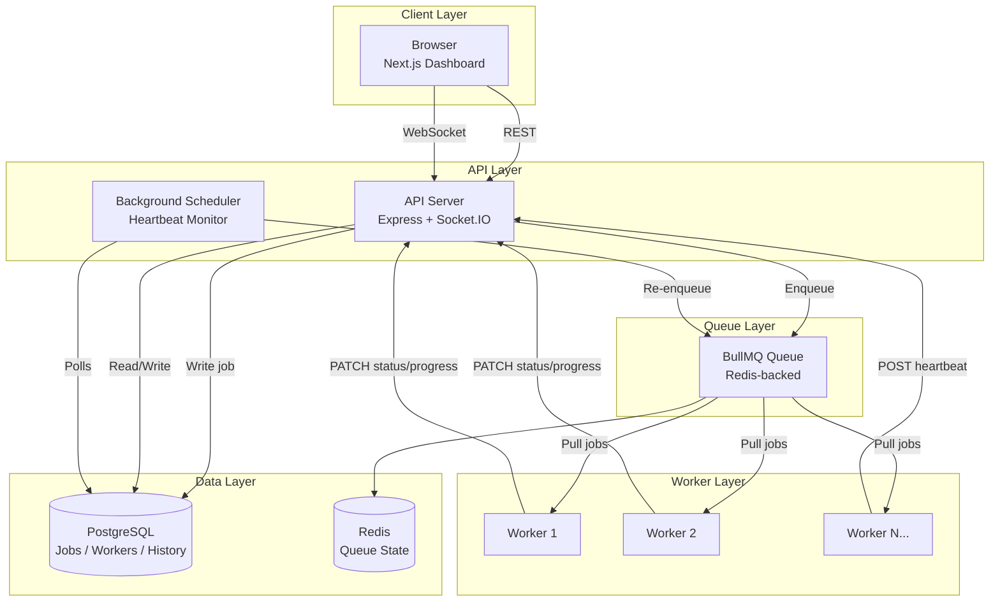
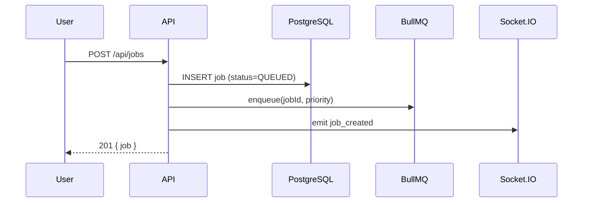
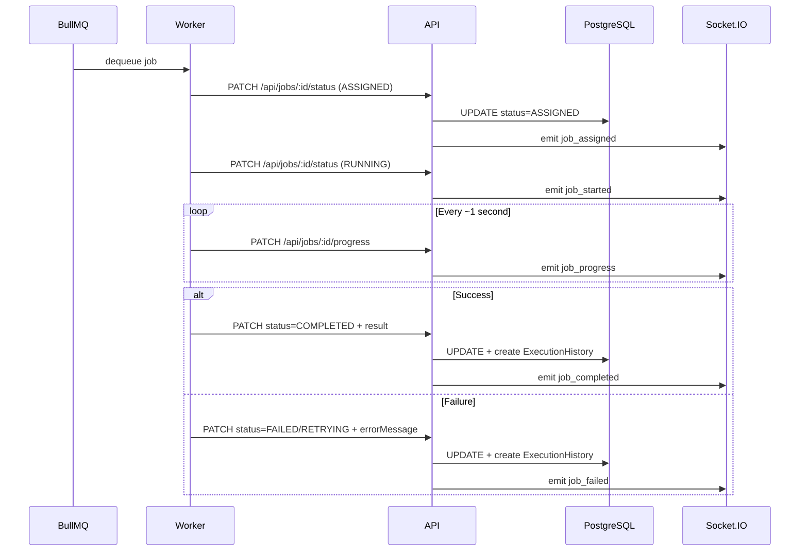
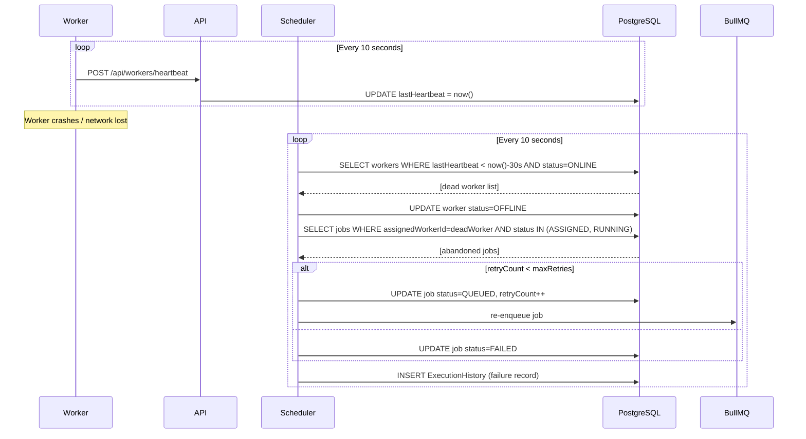

# Architecture

## System Overview

JobFlux is a distributed job execution platform designed around three core separation-of-concerns: **submission** (API server), **execution** (workers), and **monitoring** (dashboard). Redis/BullMQ decouples submission from execution; PostgreSQL is the system of record; Socket.IO provides real-time visibility.

---

## Architecture Diagram



---

## Data Flow

### Job Submission Flow



### Job Execution Flow



### Worker Heartbeat & Failure Recovery Flow



---

## Queue Prioritization

BullMQ priority queue maps our domain priorities to numeric weights:

| Domain Priority | BullMQ Weight | Processing Order |
|----------------|---------------|-----------------|
| HIGH (1) | 10 | Processed first |
| MEDIUM (2) | 5 | Default |
| LOW (3) | 1 | Processed last |

Within the same priority, jobs are FIFO by creation time.

---

## Retry Policy

Failed jobs use **exponential backoff** before re-queuing:

```
delay(attempt) = min(1000ms * 2^attempt, 30000ms)

attempt 0 → 1s
attempt 1 → 2s
attempt 2 → 4s
attempt 3 → 8s (cap = 30s)
```

Retry can be triggered two ways:
1. **Automatic** — when a worker reports failure and `retryCount < maxRetries`, the scheduler marks the job `RETRYING` and re-enqueues after the backoff delay
2. **Manual** — `POST /api/jobs/:id/retry` from the dashboard or API (only allowed on `FAILED` jobs)

---

## Database Schema

```
┌─────────────┐         ┌──────────────────┐         ┌────────────────────┐
│   workers   │         │      jobs        │         │ execution_history  │
├─────────────┤         ├──────────────────┤         ├────────────────────┤
│ id (PK)     │◄────────│ assignedWorkerId │         │ id (PK)            │
│ name        │         │ id (PK)          │◄────────│ jobId (FK)         │
│ status      │         │ type             │         │ workerId (FK)      │
│ lastHeartbt │         │ payload (JSON)   │         │ status             │
│ createdAt   │         │ priority         │         │ logs (text[])      │
│ updatedAt   │         │ status           │         │ startedAt          │
└─────────────┘         │ retryCount       │         │ completedAt        │
                        │ maxRetries       │         └────────────────────┘
                        │ progress         │
                        │ result (JSON)    │
                        │ errorMessage     │
                        │ createdAt        │
                        │ updatedAt        │
                        └──────────────────┘
```

Key indexes:
- `jobs(status)`, `jobs(priority)`, `jobs(status, priority)` — fast queue filtering
- `jobs(assignedWorkerId)` — fast abandoned job lookup during recovery
- `workers(lastHeartbeat)` — fast stale worker detection
- `execution_history(jobId)` — fast per-job history lookup

---

## Scalability Strategy

### Horizontal Worker Scaling

Workers are stateless BullMQ consumers. Scale to N workers with:
```bash
docker-compose up -d --scale worker=N
```
BullMQ distributes jobs across all consumers automatically, with concurrency=1 per worker to avoid resource contention during simulation.

### API Server Scaling

The API server is stateless (all state in Postgres + Redis). Multiple instances can run behind a load balancer. Socket.IO must use Redis adapter (`@socket.io/redis-adapter`) for broadcast correctness across instances — not implemented in this single-node version but the socket layer is isolated to make this a one-file change.

### Queue Durability

BullMQ jobs are persisted in Redis. If the API server restarts before a job is dequeued, it remains in the queue. If a worker crashes mid-job, the scheduler recovers it within 30 seconds.

### Read Scaling

For high read traffic (dashboard polling many clients), add a read replica for PostgreSQL. The Prisma client can be configured with a read replica URL for `findMany`/`findUnique` operations.

---

## Design Decisions

### 1. Worker communicates back via HTTP, not direct DB access

Workers call `PATCH /api/jobs/:id/status` rather than writing to Postgres directly. This enforces single ownership of job state transitions, makes socket broadcasts automatic and consistent, and allows workers to be fully stateless without database credentials.

**Tradeoff**: adds a network hop per progress update. At 1-second intervals this is negligible, but for ultra-high-frequency progress reporting you'd batch updates or use a side-channel.

### 2. BullMQ for queue, not bare Redis lists

BullMQ provides job persistence, priority support, delayed jobs (for retry backoff), dead-letter queues, and rate limiting out of the box. Rolling this manually on Redis lists would be error-prone.

**Tradeoff**: BullMQ has a non-trivial Redis key structure and requires `maxRetriesPerRequest: null` to avoid connection timeout errors.

### 3. Prisma for database access

Type-safe queries with auto-generated types, integrated migration system, and excellent TypeScript ergonomics. The schema is the single source of truth.

**Tradeoff**: Prisma's `$on('query')` logging adds overhead in development. Prisma does not support all advanced PostgreSQL features (e.g., full-text search without raw queries).

### 4. Scheduler runs in-process (not as a separate service)

The heartbeat monitor runs as a `setInterval` inside the API server process rather than as a separate cron service. This keeps the deployment footprint small for a single-node setup.

**Tradeoff**: if the API server restarts, the scheduler restarts too. For high-availability, this should be a separate process using a distributed lock (Redis `SET NX EX`) to ensure only one scheduler runs at a time.

### 5. Monorepo with npm workspaces

Shared types (`shared-types`) and utilities (`shared-utils`) are packages in the monorepo, consumed by all apps. This ensures type consistency without a separate npm publish step.

**Tradeoff**: workspace hoisting can cause subtle version conflicts. The `--include-workspace-root` flag in Docker builds handles this correctly.

---

## Failure Scenarios

| Scenario | Detection | Recovery |
|----------|-----------|----------|
| Worker crashes mid-job | Heartbeat stale >30s | Scheduler marks OFFLINE, re-queues job |
| API server restart | N/A | Workers reconnect via BullMQ; in-flight jobs recovered by scheduler |
| Redis restart | BullMQ reconnects | Jobs in `waiting` state survive; `active` jobs may need manual re-queue |
| Postgres connection lost | Prisma throws | API returns 500; retries on reconnect |
| Job fails repeatedly | retryCount == maxRetries | Job marked FAILED permanently; manual retry via dashboard |
